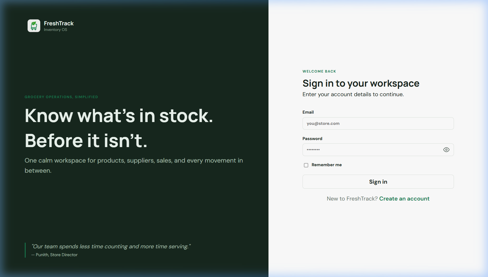
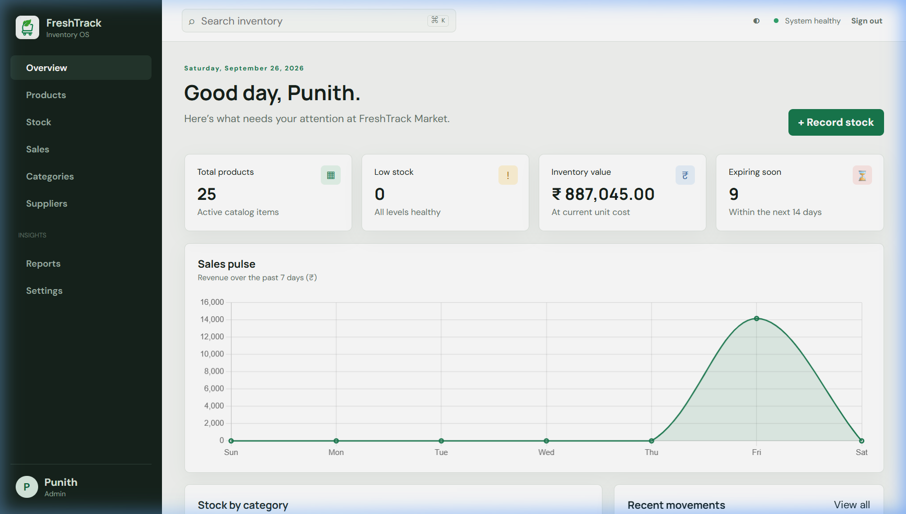
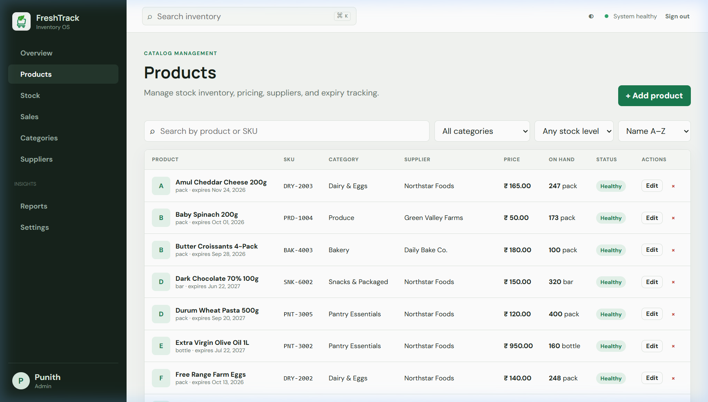
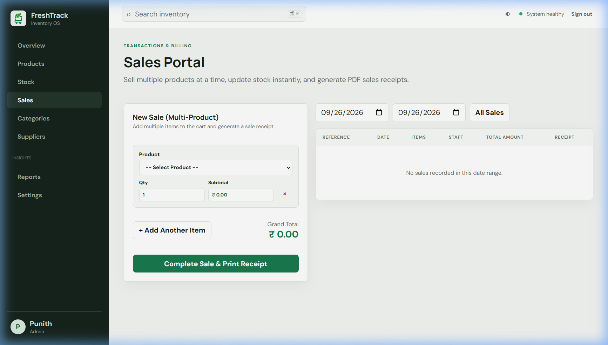
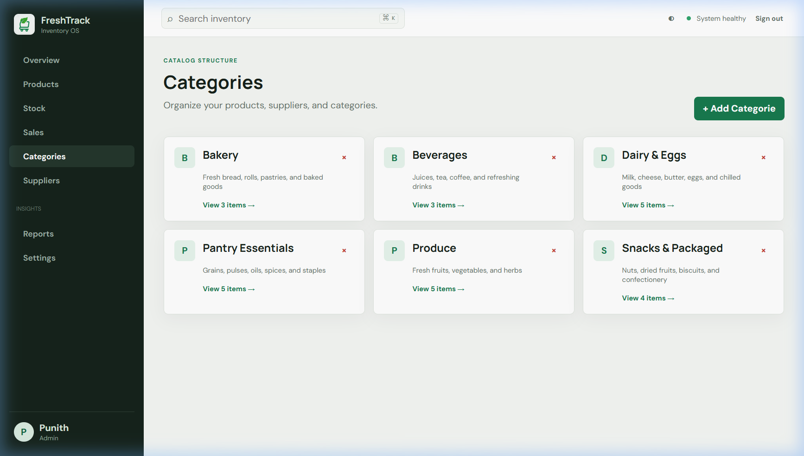

# FRESHTRACK GROCERY INVENTORY MANAGEMENT SYSTEM

**Project README / Reference Document**

## FreshTrack Grocery Inventory Management System

A web-based Grocery Inventory & Point of Sale (POS) Management System developed using Python, Flask, SQLAlchemy, SQLite, HTML5, CSS3, JavaScript, Chart.js, and ReportLab. The application helps grocery retail stores, supermarkets, and inventory managers manage products, stock movements, categories, suppliers, multi-product POS sales, and downloadable PDF sale receipts through a professional web interface.

The system features real-time inventory tracking, automatic stock deduction on sales, low-stock threshold alerts, expiry tracking, multi-item sales cart processing, itemized tax invoice PDF generation, business intelligence reports with CSV/PDF exports, Indian Rupee (INR — ₹) currency formatting, and role-based access control for Admins, Managers, and Staff.

---

## Features

- Multi-Role Access Control (Admin, Manager, Staff)
- Flexible Authentication (Login by Email, Username Handle, or Display Name)
- Executive Operations Dashboard
- Sales Pulse Analytics (7-Day Revenue Trend via Chart.js)
- Category Inventory Distribution Chart (Doughnut Chart)
- Product Catalog Management with Search, Filters, and Sorting
- Low-Stock and Expiring Product Tracking
- Category and Supplier Management
- Clickable Category Cards with Filtered Item Views
- Multi-Product POS Sales Cart Interface
- Dynamic Line-Item Subtotal and Live Grand Total Calculation
- Batch Stock Availability Validation Before Sale Completion
- Automatic Inventory Deduction on Sales
- Instant Itemized Tax Invoice / Sales Receipt PDF Generation
- Historical Sale Receipt PDF Downloads
- Automatic Today's Date Filter on Sales Portal with "All Sales" Option
- Stock Movement Audit Ledger (Stock In, Stock Out, Quantity Adjustment)
- Business Intelligence Reports (Inventory Valuation, Sales Summary, Low Stock)
- Exportable Reports in CSV and PDF Formats
- Indian Rupee (INR — ₹) Currency Formatting
- Store Profile and Settings Configuration
- Team Member Access Management
- Interactive Dark and Light Mode Theme Toggle
- Password Visibility Vector Eye Toggle Button
- Responsive Mobile-Friendly Layout
- CSRF Protection for Form Submissions
- Persistent SQLite Database Storage

---

## Tech Stack

### Frontend

- HTML5
- CSS3 (Custom CSS, Dark & Light Themes)
- JavaScript (Vanilla JS, Chart.js)
- Jinja2 Templates

### Backend

- Python 3.11+
- Flask
- Flask-SQLAlchemy
- Flask-Login
- Flask-WTF (CSRF Protection)
- Flask-Migrate

### Database

- SQLite (via SQLAlchemy ORM)

### PDF & Reporting Engine

- ReportLab (Itemized Receipts & PDF Report Exports)

---

## Project Structure

```text
grocery_inventory/
│── run.py                        # Application entry point (Port 5050)
│── config.py                     # Configuration settings
│── requirements.txt              # Dependency requirements
│── pytest.ini                    # Pytest configuration
│── README.md                     # Project documentation
│── test_app.py                   # Integration test suite
│
├── app/
│   │── __init__.py               # Flask app factory
│   │── models.py                 # SQLAlchemy database models
│   │── forms.py                  # WTForms forms & validators
│   │── seed.py                   # CLI database seed command
│   │── extensions.py             # Extensions (db, login, csrf, migrate)
│   │
│   ├── routes/
│   │   │── auth.py               # Authentication blueprint
│   │   └── main.py               # Core application blueprint
│   │
│   ├── utils/
│   │   └── decorators.py         # Role-based access decorators
│   │
│   ├── static/
│   │   │── css/
│   │   │   └── style.css         # Core CSS & theme styling
│   │   │── js/
│   │   │   └── main.js           # Charts & interactive JS
│   │   │── logo.jpg              # Store branding logo
│   │   └── favicon.svg           # Favicon icon
│   │
│   └── templates/
│       │── base.html             # Base layout template
│       │── dashboard.html        # Analytics dashboard view
│       │── products.html         # Catalog management view
│       │── sales.html            # POS multi-product cart & history view
│       │── stock.html            # Movement ledger view
│       │── reports.html          # BI reports & exports view
│       │── settings.html         # Store settings & team access view
│       │── simple_crud.html      # Category & Supplier cards view
│       ├── _macros.html          # Form field & modal macros
│       └── auth/
│           ├── login.html        # Sign-in view
│           └── register.html     # Registration view
│
├── instance/
│   └── inventory.db              # SQLite database
├── screenshots/                    # Application screenshots for README
│   ├── login_page.png
│   ├── dashboard.png
│   ├── products_page.png
│   ├── sales_page.png
│   └── categories_page.png
└── tests/
    └── test_app.py               # Unit test suite
```

---

## Database Tables

The system uses SQLite via SQLAlchemy to store user profiles, store settings, categories, suppliers, product catalog items, stock movements, sales transactions, and sale line items.

### User Table

| Field | Description |
|---|---|
| User ID | Unique user identifier |
| Email | Unique email address used for login |
| Password Hash | Werkzeug security password hash |
| Is Active Account | Boolean flag indicating active user account |
| Created At | Timestamp of account creation |

### Staff Profile Table

| Field | Description |
|---|---|
| Profile ID | Unique profile identifier |
| User ID | Foreign key referencing `user.id` |
| Display Name | Full display name (e.g. Punith) |
| Avatar | Profile avatar image path |

### User Role Table

| Field | Description |
|---|---|
| Role ID | Unique role record identifier |
| User ID | Foreign key referencing `user.id` |
| Role | User access role (`admin`, `manager`, `staff`) |

### Category Table

| Field | Description |
|---|---|
| Category ID | Unique category identifier |
| Name | Unique name (e.g. Produce, Dairy & Eggs) |
| Description | Category description |

### Supplier Table

| Field | Description |
|---|---|
| Supplier ID | Unique supplier identifier |
| Name | Unique company name (e.g. Green Valley Farms) |
| Contact Name | Contact person name |
| Email | Supplier email address |
| Phone | Supplier phone number |
| Address | Supplier physical address |

### Product Table

| Field | Description |
|---|---|
| Product ID | Unique product identifier |
| Name | Product name |
| SKU | Unique SKU / Barcode identifier |
| Category ID | Foreign key referencing `category.id` |
| Supplier ID | Foreign key referencing `supplier.id` |
| Price | Selling price in Indian Rupees (INR) |
| Cost | Unit cost in Indian Rupees (INR) |
| Quantity | Units currently on hand |
| Low Stock Threshold | Quantity threshold for low-stock alerts |
| Unit | Measurement unit (kg, bottle, pack, loaf, etc.) |
| Expiry Date | Product expiry date |
| Image | Uploaded product image filename |
| Created At | Product creation timestamp |

### Stock Movement Table

| Field | Description |
|---|---|
| Movement ID | Unique movement record identifier |
| Product ID | Foreign key referencing `product.id` |
| User ID | Foreign key referencing `user.id` recording movement |
| Movement Type | Type of movement (`in`, `out`, `adjustment`) |
| Quantity | Movement quantity |
| Note | Audit note or sale reference |
| Created At | Timestamp of movement |

### Sale Table

| Field | Description |
|---|---|
| Sale ID | Unique sale identifier |
| Reference | Unique invoice reference (e.g. `SALE-20250510-X1Y2Z3`) |
| User ID | Foreign key referencing `user.id` (cashier) |
| Total | Total transaction amount in INR |
| Created At | Timestamp of sale completion |

### Sale Item Table

| Field | Description |
|---|---|
| Item ID | Unique sale item identifier |
| Sale ID | Foreign key referencing `sale.id` |
| Product ID | Foreign key referencing `product.id` |
| Quantity | Quantity sold |
| Unit Price | Unit selling price at time of sale |

### Store Setting Table

| Field | Description |
|---|---|
| Setting ID | Unique setting identifier |
| Store Name | Name of the store (e.g. FreshTrack Market) |
| Email | Store contact email |
| Phone | Store contact phone |
| Address | Store physical address |
| Currency | Store currency code (`INR`) |

---

## Business Logic and Rules

Before operations are executed, the system enforces strict validation and business rules:

- **Stock Depletion Control**: Sales cannot exceed available stock. Every cart item is validated before transaction processing.
- **Automatic Stock Deduction**: Selling items immediately deducts product quantities and records an audit log entry.
- **Audit Ledger**: Every stock movement (`in`, `out`, `adjustment`) records who performed it, when, and why.
- **Role-Based Permissions**:
  - **Staff**: Browse products, record sales, perform stock movements, view categories.
  - **Manager**: All staff features + manage products, categories, suppliers, BI reports, and PDF exports.
  - **Admin**: All manager features + user access management, store settings, and record deletion.
- **Itemized Tax Invoice Receipts**: Generated via ReportLab featuring Store Header, Receipt Reference, Cashier Name, Date, Itemized Line Items, Total Items, Grand Total in INR (₹), and Footer Notice.

---

## Application Workflow

1. Configure Store Profile and Currency Settings
2. Add Product Categories
3. Add Suppliers
4. Create Products in Catalog with Opening Stock
5. Track Stock Status (Healthy, Low Stock, Out of Stock)
6. Record Stock Movements (Deliveries, Adjustments)
7. Access POS Sales Portal
8. Add Multiple Items to Cart with Quantities
9. Review Live Line Subtotals and Grand Total
10. Validate Stock Availability
11. Complete Sale Transaction
12. Automatic Stock Deduction & Audit Logging
13. Generate and Download Itemized PDF Sale Receipt
14. Filter Sales History by Date Range or View Today's Sales
15. View Analytics Dashboard & Sales Pulse Charts
16. Generate Business Intelligence Reports
17. Export Reports to CSV and PDF

---

## Working Flow

```text
Store Profile & Settings
   ↓
Categories & Suppliers
   ↓
Product Catalog Setup
(Name + SKU + Category + Supplier + Price + Quantity + Threshold)
   ↓
Stock Movements Audit Ledger
(Stock In / Stock Out / Quantity Adjustments)
   ↓
Multi-Product POS Sales Cart
   ↓
Batch Stock Validation
   ↓
Transaction Processing & Stock Deduction
   ↓
ReportLab Receipt Generator -> Downloadable PDF Invoice
   ↓
Analytics Dashboard & BI Reports (CSV / PDF)
```

---

## User Interface

The application interface includes:

- Sidebar Navigation Area (Role-Adaptive)
- Overview Analytics Dashboard
- Summary Stat Cards (Total Products, Low Stock, Inventory Value in ₹, Expiring Soon)
- 7-Day Revenue Trend Chart (Chart.js)
- Stock Distribution Doughnut Chart (Chart.js)
- Recent Stock Activity Audit Feed
- Top Selling Products Ranking
- Product Catalog Table with Thumbnail Badges and Search
- Auto-Submitting Filter Controls for Category, Stock Level, and Sorting
- Edit Product Modal with Pre-filled Form Values
- Multi-Item POS Cart Interface with Live Calculation
- Automatic Today's Sales Filter with "All Sales" Reset Option
- Actionable PDF Sale Receipt Download Links
- Clickable Category Cards Linking directly to Filtered Items
- Stock Control Ledger Table
- Business Intelligence Reports Section (Valuation, Sales, Low Stock)
- Export Controls for CSV and PDF Files
- Store Profile Settings and Team Access Table
- Password Visibility Vector Eye Toggle Button
- Dark / Light Theme Toggle Switch
- Responsive Mobile Navigation Drawer

---

## Screenshots

### Login Page



### Dashboard



### Products Catalog



### Sales Portal (POS)



### Categories & Suppliers



---

## Security and Data Integrity

- **CSRF Protection**: Token validation for form submissions via Flask-WTF.
- **Password Security**: Password hashing using Werkzeug security handlers.
- **Role Enforcement**: Server-side `@roles_required` decorator checks on protected endpoints.
- **Stock Transaction Integrity**: Atomic database transactions ensure all cart items are valid before committing sales.
- **Database Safety**: Foreign key constraints and transaction rollback mechanisms.
- **Input Sanitization**: File uploads secured with `secure_filename` and unique UUIDs.

---

## Installation

### 1. Clone the Project

```bash
git clone https://github.com/your-username/grocery_inventory_management.git
cd grocery_inventory_management/grocery_inventory
```

### 2. Create a Virtual Environment

```bash
python -m venv .venv
```

### 3. Activate the Virtual Environment

#### Linux / macOS

```bash
source .venv/bin/activate
```

#### Windows (Command Prompt)

```cmd
.venv\Scripts\activate
```

#### Windows (PowerShell)

```powershell
.\.venv\Scripts\Activate.ps1
```

### 4. Install Dependencies

```bash
pip install -r requirements.txt
```

### 5. Seed the Database

```bash
python -m flask --app app seed
```

### 6. Run the Application

```bash
python run.py
```

### 7. Open the Application

Open your browser and navigate to:

```text
http://127.0.0.1:5050/
```

---

## Demo Credentials

| Role | Username / Email | Password | Access Level |
|---|---|---|---|
| **Admin** | `admin@freshtrack.example` *(or `admin` / `Punith`)* | `Admin123!` | Full Admin (Settings, Users, Catalog, Delete) |
| **Manager** | `manager@freshtrack.example` *(or `manager` / `Punith`)* | `Manager123!` | Manager (Catalog, Stock, Sales, Reports) |
| **Staff** | `staff@freshtrack.example` *(or `staff`)* | `Staff123!` | Staff (Catalog Browse, Stock Movements, Sales Cart) |

---

## Running Tests

To run the PyTest unit test suite:

```bash
python -m pytest
```

To run the end-to-end integration test suite:

```bash
python test_app.py
```

---

## Author

**Student Name:** Punith Gowda  
**USN:** U18IN24S0037  
**Course:** BCA  
**Project:** Grocery inventory management

**Technologies:**  
Python | Flask | SQLAlchemy | SQLite | HTML5 | CSS3 | JavaScript | Chart.js | ReportLab

---

## License

This project is developed for educational, retail operations, portfolio, and commercial reference purposes.
